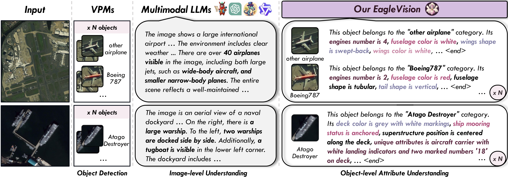
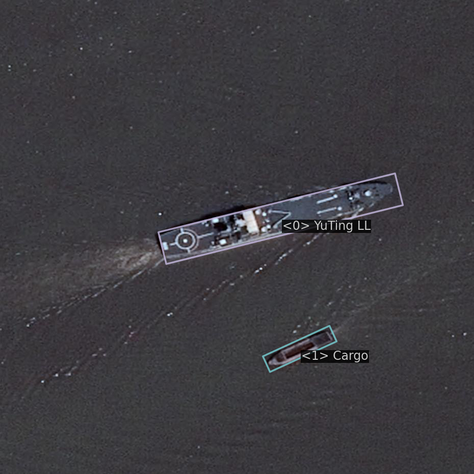
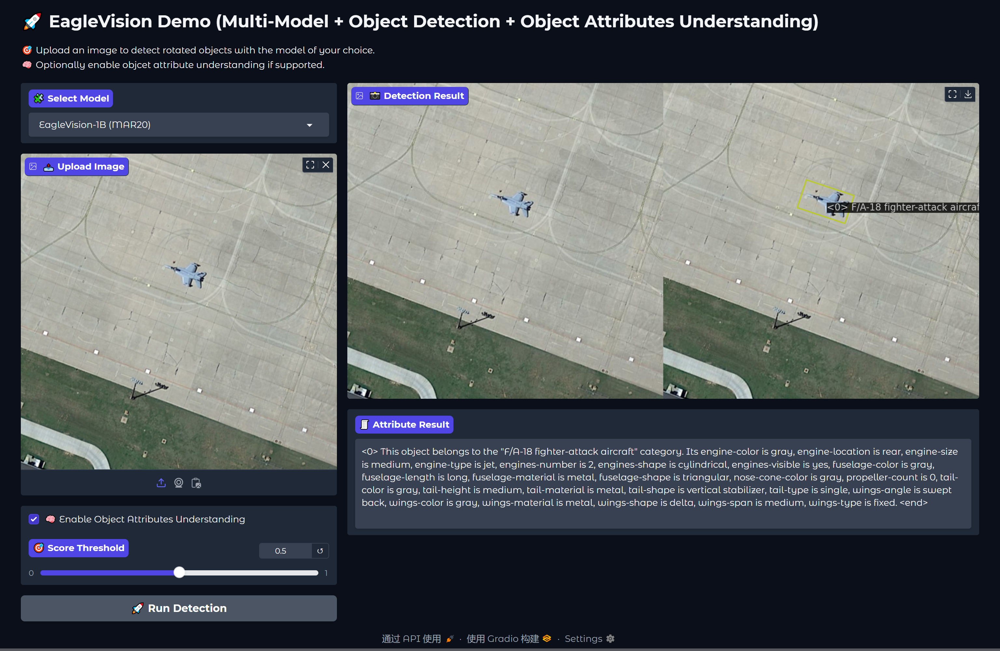

# EagleVision: Object-level Attribute Multimodal LLM for Remote Sensing

<a href="https://arxiv.org/abs/2503.23330" target="_blank"></a>
<a href="https://huggingface.co/liarzone" target="_blank"></a>
<a href="https://huggingface.co/datasets/liarzone/EVAttrs-95K" target="_blank"></a>

**Authors:**  
[Hongxiang Jiang](https://github.com/XiangTodayEatsWhat), [Jihao Yin*](https://scholar.google.com/citations?hl=zh-CN&user=-1deilUAAAAJ), [Qixiong Wang](https://scholar.google.com/citations?user=rlr_izYAAAAJ), [Jiaqi Feng](https://github.com/fengjiaqi927), [Guo Chen](https://github.com/arbani369)

<p align="center"></p>

---

## 📑 Table of Contents
- [🗞️ News](#news)
- [1. 🔍 Introduction](#1-introduction)
- [2. ⚙️ Installation](#2-installation)
- [3. 🚀 Usage](#3-usage)
  - [3.1 Quick Start](#31-quick-start)
  - [3.2 Training & Testing](#32-training--testing)
- [4. 🎛️ Gradio Demo](#4-gradio-demo)
- [📚 BibTeX](#bibtex)

---

## News

> 🔥 [2025-03-29] **EVAttrs-95K dataset is now available!**  
> [🔗 View on Hugging Face](https://huggingface.co/datasets/liarzone/EVAttrs-95K)

---

## 1. Introduction

**EagleVision** is a Multimodal Large Language Model (MLLM) tailored for **remote sensing** that excels in **object detection** and **object attribute comprehension**. 

<p align="center"></p>

EagleVision achieves state-of-the-art performance on both fine-grained object detection and object attribute understanding tasks, highlighting the mutual promotion between detection and understanding capabilities in MLLMs. 

---

## 2. Installation

```bash
conda create -n EagleVision python=3.10
conda activate EagleVision 

pip install torch==2.1.2 torchvision==0.16.2 torchaudio==2.1.2 --index-url https://download.pytorch.org/whl/cu118

pip install -U openmim
mim install mmengine==0.10.5
pip install mmcv==2.1.0 -f https://download.openmmlab.com/mmcv/dist/cu118/torch2.1/index.html
pip install mmdet==3.3.0
pip install -v -e .

wget https://github.com/Dao-AILab/flash-attention/releases/download/v2.6.3/flash_attn-2.6.3+cu118torch2.1cxx11abiFALSE-cp310-cp310-linux_x86_64.whl
pip install flash_attn-2.6.3+cu118torch2.1cxx11abiFALSE-cp310-cp310-linux_x86_64.whl

pip install transformers==4.47.1 peft==0.4.0 numpy==1.26.3 imageio==2.36.0 einops==0.6.1 \
    timm==1.0.9 deepspeed==0.16.1 sentencepiece==0.2.0 protobuf==4.25.4
```

---

## 3. Usage

<p align="center"></p>

Use pre-trained EagleVision models for object detection and attribute understanding, or train your own!

### 3.1 Quick Start

#### 🔗 Pretrained Models

| Model | Params | LLM | HuggingFace |
|-------|--------|--------------|-------------|
| **EagleVision-1B** | 0.64B | [Qwen2-0.5B-Instruct](https://huggingface.co/Qwen/Qwen2-0.5B-Instruct) | [Link](https://huggingface.co/liarzone/EagleVision-1B) |
| **EagleVision-2B** | 1.92B | [internlm2-chat-1-8b](https://huggingface.co/internlm/internlm2-chat-1_8b) | [Link](https://huggingface.co/liarzone/EagleVision-2B) |
| **EagleVision-4B** | 3.86B | [Phi-3-mini-128k-instruct](https://huggingface.co/microsoft/Phi-3-mini-128k-instruct) | [Link](https://huggingface.co/liarzone/EagleVision-4B) |
| **EagleVision-7B** | 7.77B | [internlm2_5-7b-chat](https://huggingface.co/internlm/internlm2_5-7b-chat) | [Link](https://huggingface.co/liarzone/EagleVision-7B) |

#### ⚡ Inference

```bash
# Object detection
python tools/infer.py demo/demo1.png ${model_path}/EagleVision-7B/SHIPRS/mp_rank_00_model_states.pt \
    configs/EagleVision/EagleVision_7B-shiprsimagenet.py --score-thr 0.5

# Detection + Attribute Understanding
python tools/infer.py demo/demo1.png ${model_path}/EagleVision-7B/SHIPRS/mp_rank_00_model_states.pt \
    configs/EagleVision/EagleVision_7B-shiprsimagenet.py --score-thr 0.5 --with-attribute
```

<details>
<summary><strong>🖼️ Example Output</strong></summary>

<p align="center"></p>

```bash
<0> This object belongs to the "YuTing LL" category. Its ship-visibility is clear, ship-purpose is military, ship-motion is stationary, ship-capacity is medium, ship-load-status is unloaded, ship-cargo-status is no cargo, ship-mooring-status is moored, hull-color is gray, hull-size is large, hull-shadow is visible, hull-outline is sharp, superstructure-color is gray, superstructure-size is medium, superstructure-height is moderate, superstructure-position is central, paint-condition is good, bow-design is sharp, stern-design is flat, deck-utilization is moderate, deck-condition is good, deck-obstacles is minimal, deck-color is gray, deck-structure is flat, deck-accessories is helicopter landing pad, container-count is 0, machinery-presence is visible, location is dockside, weather-condition is clear, water-color is dark blue, water-turbulence is calm, unique-attributes is helicopter landing pad on deck. <end>

<1> This object belongs to the "Cargo" category. Its ship-visibility is partially visible, ship-purpose is cargo transport, ship-motion is stationary, ship-capacity is large, ship-load-status is loaded, ship-cargo-status is secured, ship-mooring-status is moored, hull-color is dark gray, hull-size is large, hull-shadow is visible, hull-outline is clear, superstructure-color is light gray, superstructure-size is medium, superstructure-height is low, superstructure-position is central, paint-condition is worn, bow-design is rounded, stern-design is flat, deck-utilization is high, deck-condition is worn, deck-obstacles is minimal, deck-color is dark gray, deck-structure is flat, deck-accessories is minimal, container-presence is yes, container-count is multiple, container-color is varied, container-layout is stacked, container-alignment is aligned, container-densities is dense, container-type is standard, machinery-presence is yes, location is waterway, weather-condition is clear, water-color is dark blue, water-turbulence is low, unique-attributes is large cargo ship with multiple containers. <end>
```

</details>

### 3.2 Training & Testing

Download the following datasets and organize them as below:

- [EVAttrs-95K](https://huggingface.co/datasets/liarzone/EVAttrs-95K)
- [SHIPRSImageNet](https://github.com/zzndream/ShipRSImageNet)
- [MAR20](https://gcheng-nwpu.github.io/)
- [FAIR1M](https://www.gaofen-challenge.com/benchmark)

```
data/
├── SHIPRSImageNet/
│   ├── train/val
│   │   ├── images/
│   │   ├── annfiles/
│   │   └── labelXml/
│   └── EVAttrs-95K-ShipRSImageNet-{train,val}.json
├── MAR20/
│   ├── train/test
│   │   ├── images/
│   │   ├── annfiles/
│   │   └── labelXml/
│   └── EVAttrs-95K-MAR20-{train,test}.json
├── FAIR1M/
│   ├── train/val/trainval/test
│   │   ├── images/
│   │   └── labelXml/
│   ├── split_ss/
│   │   ├── train/val/trainval/test
│   │   │   ├── images/
│   │   │   └── annfiles/
│   └── EVAttrs-95K-FAIR1M-{train,val}.json
```

Ensure `annfiles` follow DOTA-style with attribute dictionary:
```
432.0 482.0 405.0 503.0 398.0 494.0 425.0 473.0 </cls_name>Other Ship</cls_name> 0 ${attribute_dict}
```


#### 🛠️ Training

```bash
torchrun --nproc_per_node 4 --master_port ${master_port} tools/train.py ${config_file}
```

#### 🧪 Testing

```bash
# Task 1: Detection
torchrun --nproc_per_node 1 tools/test.py ${config_file} ${model_path} --task 1

# Task 2: Attribute Understanding
torchrun --nproc_per_node 1 tools/test.py ${config_file} ${model_path} --task 2

# Evaluate for attribute understanding
pip install openai==1.3.5 validators==0.34.0 ...
cd VLMEvalKit && pip install -e .
python tools/benchmark/EVBench_evaluation.py --root-dir ${work_dir}/val/Task2.json --openai-key ${key}
```

---

## 4. Gradio Demo

```bash
pip install gradio
python demo/app.py
```

<p align="center"></p>

---

## BibTeX

```bibtex
@misc{jiang2025eaglevisionobjectlevelattributemultimodal,
      title={EagleVision: Object-level Attribute Multimodal LLM for Remote Sensing}, 
      author={Hongxiang Jiang and Jihao Yin and Qixiong Wang and Jiaqi Feng and Guo Chen},
      year={2025},
      eprint={2503.23330},
      archivePrefix={arXiv},
      primaryClass={cs.CV},
      url={https://arxiv.org/abs/2503.23330}, 
}
```